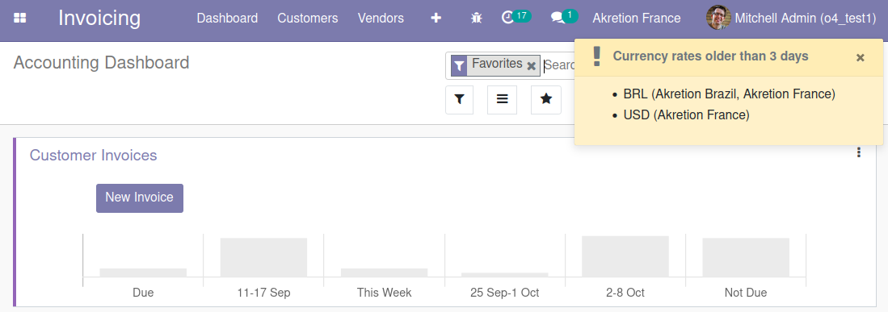

This module notifies users of the group *Billing Administrator* when currency rates are older than 3 days (this default number of days can be modified).

When Odoo converts an amount to another currency at date D in company C, it takes the currency rate of company C (or with an empty *Company* field) that is dated date D or the closest rate before date D. But Odoo doesn't say anything when there is no rate on date D and the closest rate before date D is far away in the past. This is a real problem because the converted amount may be irrelevant!

This module provides a daily monitoring of the necessity to always have up-to-date rates in your Odoo database.

If the user is allowed in several companies, the notification pop-up will display, for each currency, in which companies the lastest rate is too old.
